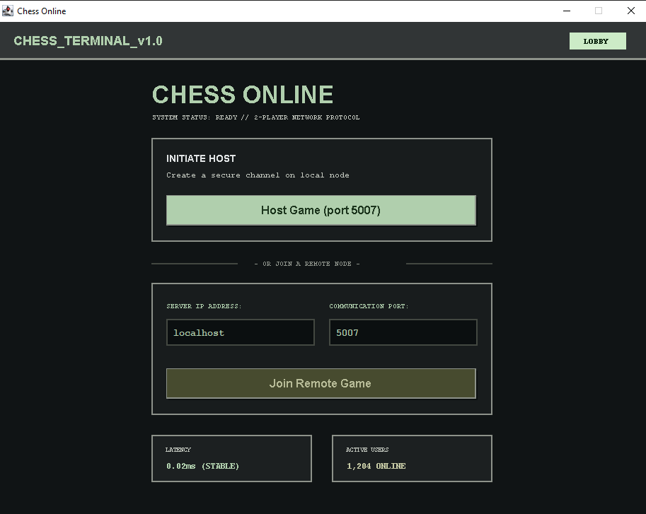
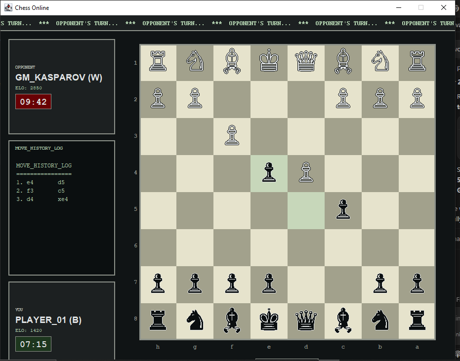

# Chess Online - Multiplayer Network Chess Game

[](https://opensource.org/licenses/MIT)
[](https://www.oracle.com/java/)
[]()

A two-player chess game operating over a network using TCP sockets. Designed as a final project for the Network Programming Lab course, this game combines modern socket programming with a polished retro-futuristic Cyberpunk/CRT terminal interface built entirely on Java Swing.

---

## 📸 Screenshots

Here is a visual overview of the game interfaces:

| Start Screen / Lobby | Game Board |
|---|---|
|  |  |

---

## ✨ Key Features

* **Multiplayer over TCP/IP**: Pure Java socket implementation using a client-server architecture.
* **Modern Retro CRT UI**: A cyberpunk-themed interface containing a radial vignette glass glow,horizontal scanlines, and a retro marquee scrolling status bar.
* **Dynamic Board Flipping**: The board automatically rotates for the Black player (so they play from their own perspective, moving upwards from the bottom) and updates notation rails (`1-8` vs `8-1` and `a-h` vs `h-a`) accordingly.
* **Multi-threaded Server**: Uses a synchronized, thread-per-client loop on the server to prevent freezes and immediately detect client disconnections or out-of-turn rematch requests.
* **Smart Server Hosting**: Hosting a match automatically spins up the server in a background thread of the client host, eliminating the need to start a server manually in a separate terminal.
* **Robust Safety Checks**: Validates chess coordinates to prevent moving pieces off-board, resets en passant options correctly on non-pawn moves, and breaks early on out-of-bounds king check scans.
* **Port Collision Guard**: Auto-detects HTTP servers or other non-chess services running on the game port, and disconnects gracefully with instructions on how to change ports.

---

## 🏗️ Architecture & Component Breakdown

The project follows a modular client-server structure:

```
src/main/java/org/example/
├── main/
│   └── Main.java              # Entry point, configures screens and handles connections
├── ui/
│   ├── StartScreen.java       # Centered lobby panel with host/join buttons and IP/Port inputs
│   ├── GamePanel.java         # Gameplay interface containing board, rails, history log, and controls
│   ├── EndScreen.java         # Game over panel displaying results and rematch buttons
│   ├── CRTPanel.java          # Wrapper panel applying scanlines and CRT glass vignette filters
│   └── FontManager.java       # Cache manager that loads/downloads custom Google fonts
├── network/
│   ├── Server.java            # Thread-safe server hosting game lobbies and relaying protocol tokens
│   ├── Client.java            # Network client handling TCP connection and protocol parsing
│   └── ClientHandler.java     # Server-side wrapper representing a connected socket client
└── game/
    ├── Board.java             # Holds board piece positions, rendering, and move validation rules
    ├── GameManager.java       # Manages matches, turn switching, and game over triggers
    ├── Move.java              # Represents a move event (coordinates + captured piece status)
    └── pieces/
        ├── Piece.java         # Base abstract representation of a chess piece
        └── Pawn/Rook/Knight/Bishop/Queen/King.java  # Specific piece implementations
```

For a detailed diagram of the TCP message flow and sequencing, see the [Architecture Documentation](docs/architecture.md).

---

## 🚀 Installation & Setup

### Prerequisites
* **Java 20** or newer. Verify by running:
  ```bash
  java -version
  ```
* Maven is optional; standard compilation via `javac` is supported out-of-the-box.

### 1. Compile the Project
Open a shell in the root of the project directory and run:
```bash
javac -d out -sourcepath src/main/java src/main/java/org/example/main/Main.java src/main/java/org/example/network/Server.java
```

### 2. Launch Client 1 (Host / White)
Run the main launcher:
```bash
java -cp out org.example.main.Main
```
Click **Host Game (port 5007)**. This will start the server on port `5007` in a background thread and connect your client as the White player.

### 3. Launch Client 2 (Join / Black)
In a second terminal window, run:
```bash
java -cp out org.example.main.Main
```
Click **Host Game (port 5007)** or **Join Remote Game** using the default settings. This connects you as the Black player, and the board will display immediately!

---

## 📡 Protocol Specification

The clients and server communicate using plain-text message tokens terminated by newlines:

| Token | Direction | Meaning |
|---|---|---|
| `COLOR white/black` | Server ➡️ Client | Assigns player color. |
| `WAIT` | Server ➡️ Client | Instructs Player 1 to wait for Player 2. |
| `START` | Server ➡️ Client | Notifies both clients that Player 2 joined. |
| `MOVE col,row,col,row` | Client ↔️ Server | Transmits a move event (from `col,row` to `col,row`). |
| `GAMEOVER result` | Client ↔️ Server | Notifies checkmate/stalemate winner. |
| `PLAYAGAIN` | Client ➡️ Server | Requests a rematch. |
| `RESET` | Server ➡️ Client | Starts a new match once both players agree. |

---

## 📄 License
This project is open-source and available under the [MIT License](LICENSE).
