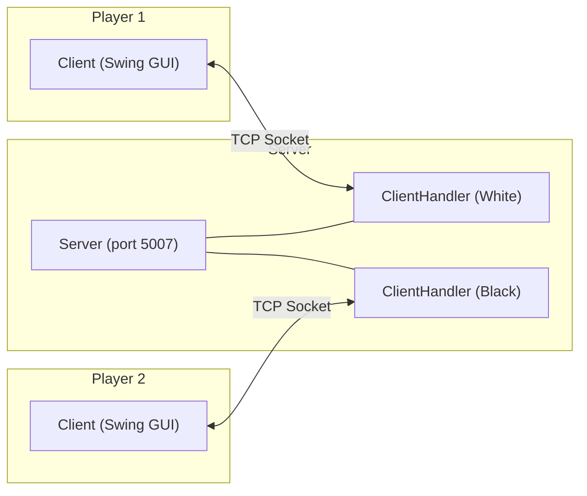
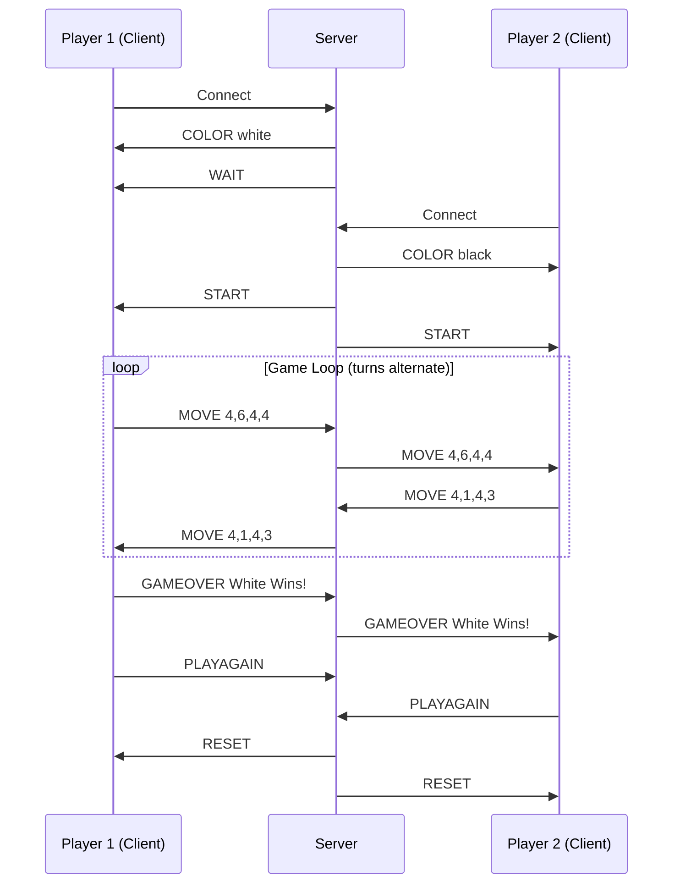

# Architecture Overview

This document gives a quick overview of how the chess game is structured and how the different parts communicate.

## System Architecture

The game follows a client-server model. The server sits in the middle and relays moves between two clients. Each client has its own GUI and game logic.

The server itself is pretty simple. It does not know anything about chess rules. All it does is:
1. Accept two connections
2. Assign colors (White to the first player, Black to the second)
3. Forward moves from one player to the other
4. Handle play-again requests

Move validation, check detection, and game over logic all happen on the client side in the `game` package.

## Message Flow

This diagram shows the full lifecycle of a game session, from connection to game over.

## Package Structure

Each package has a specific responsibility:

| Package | What it does |
|---------|-------------|
| `main` | Application entry point. Sets up the JFrame and wires everything together. |
| `ui` | All the Swing panels (start screen, game board, end screen). Handles user input. |
| `network` | TCP socket communication. Client connects to server, sends/receives text messages. |
| `game` | Chess logic. Board state, move validation, check/checkmate detection. |
| `game.pieces` | Individual piece classes. Each piece knows its own movement rules. |

## How a Move Happens

When a player clicks and drags a piece, here is what happens step by step:

1. `GamePanel` detects the mouse event and identifies which piece was clicked
2. `GamePanel` calls `GameManager.tryMove()` with the old and new coordinates
3. `GameManager` checks if it is the player's turn and if the piece belongs to them
4. `Board.isValidMove()` checks if the move follows the piece's rules and does not leave the king in check
5. If valid, `Board.makeMove()` updates the board state
6. `Client.sendMove()` sends the move to the server as a text message
7. The server forwards the message to the opponent's `ClientHandler`
8. The opponent's `Client` receives it and calls `GameManager.applyOpponentMove()`
9. The board repaints to show the new state
